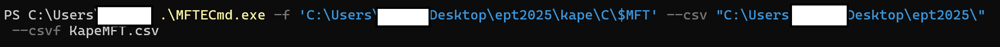
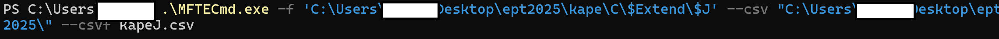
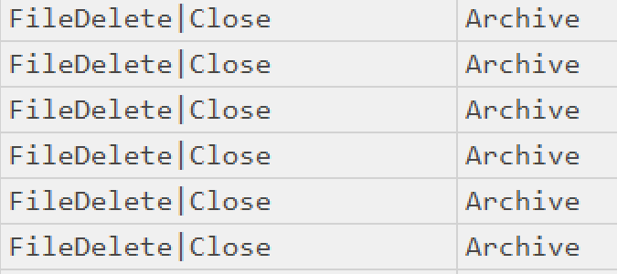
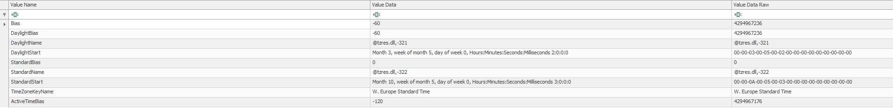
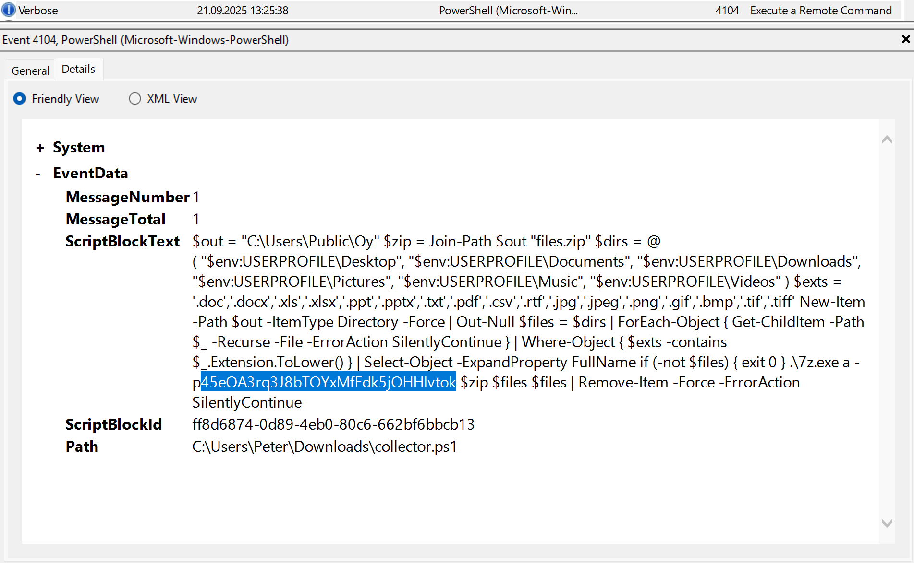
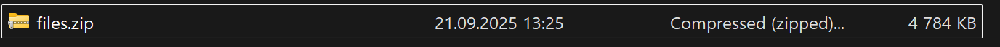
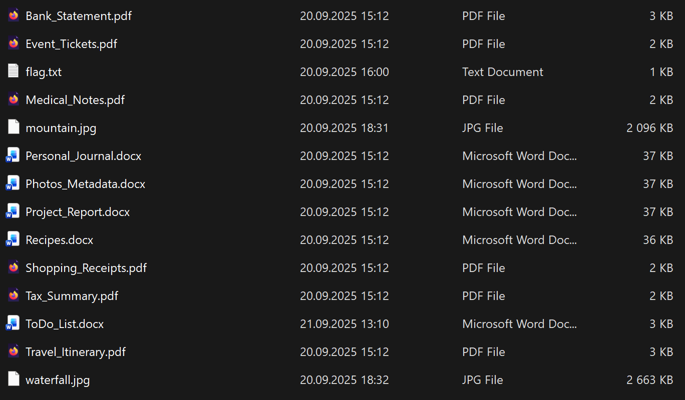
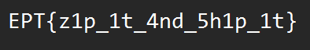

# Writeup: Home Intrusion
## Team: Trånn Jånn
**Author:** Dragsund

---

Original challenge task:
>Peter is in a panic! All his personal documents have vanished. The only thing he recalls before they disappeared was struggling to edit some PDFs.
Something doesn't add up. Can you trace what happened and help recover his files?

---

For this challenge we were provided with a filesystem of a windows computer.

The first thing I did was parse both the $J and $MFT for analysation with Eric Zimmermans MFTECmd.exe

I then used Eric Zimmermans Timeline Explorer to further analyse.
I startet out with filtering out ".pdf" and found the timestamp where all of the .pdf's were deleted.

 

I then procedeed to check the machines timezone by checking the SYSTEM hive in Eric Zimmermans Registry Explorer. And saw that it was using W. Europe standard time (UTC+00:00)

I then went into the Powershell Operational and filtered for Event ID 4104 to look for anything suspicious. As I discovered earlier the files were deleted 11:25:48 so I looked for something around that time, but there were no 4104 events before 12:53:34. I then remembered Timezone offsets and proceeded to look for 13:25:48 and saw an interesting Event 13:25:38.

This Event shows a powershell script which creates a .zip folder and moves users documents into it and encrypts it, before deleting the documents. 

I can also see the password in cleartext in the script: `45eOA3rq3J8bTOYxMfFdk5jOHHlvtok`

I then went to kape\C\Users\Public\Oy and found the zipped file called: `files.zip`

I extracted the .zip with the password I found.

In the .zip there is a .txt called flag. When opened I'm presented with the flag.

Flag: `EPT{z1p_1t_4nd_5h1p_1t}`

---

**Disclosure:** I didn't complete this task until after the CTF, but I still wanted to create a writeup for it.