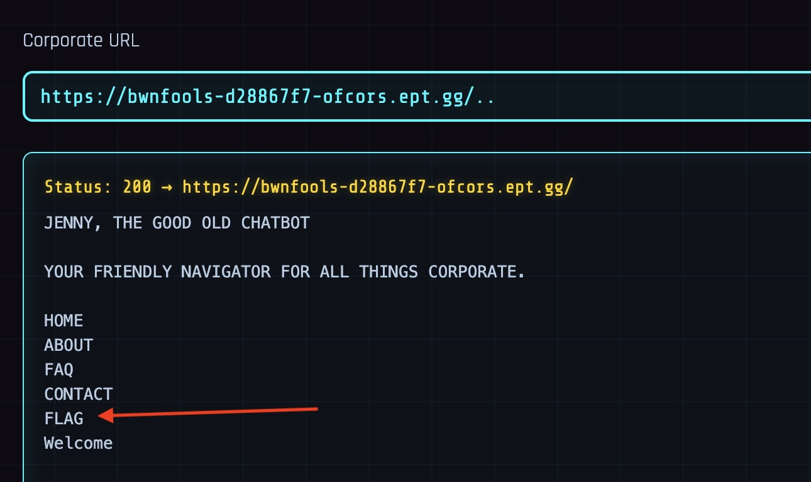

# Writeup: Of CORS I Can Help!
## Team: bwnfools
**Author:** sparekonto

## Process

I solved this by probably an unitended flaw. I first checked if it will return directories by using `/..`
It then returned a list of files(?) and directories.

I spotted the file or directory `FLAG`

I reached the flag by using the following in the url `/..\/FLAG`

## Result

The service then returned : `{"flag":"EPT{CORS_t0tally_trU5t5_y0u}"}`

Flag: `EPT{CORS_t0tally_trU5t5_y0u}`
